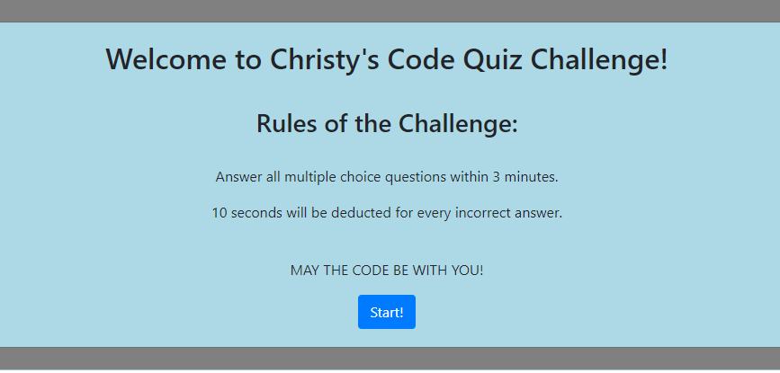

# Code Quiz

This code quiz tests a coding bootcamp student's knowledge on JavaScript fundamentals. All questions are multiple choice and students must ansewr all 7 quiz questions within 3 minutes. For every incorrect answer, 10 seconds will be deducted from the timer. 

 

 

## Coding Process

This was by far the most difficult project to get through with many hours put in researching and trying to find a solution code to make this code quiz run. Unfortunately, I was unsuccessful in achieving this goal. 

Please view the source code below.

 

  

 

To view the live website, please navigate to the **Deployed Link** below or  [click here](https://christyglee.github.io/code_quiz/) to view the page.

 

## Powered By

* [HTML](https://developer.mozilla.org/en-US/docs/Web/HTML)
* [CSS](https://developer.mozilla.org/en-US/docs/Web/CSS)
* [Javascript](https://developer.mozilla.org/en-US/docs/Web/JavaScript)
* [Bootstrap](https://getbootstrap.com/)

 

### Other Resources Used

* [Visual Studio Code](https://code.visualstudio.com/)
    * [How to install VS Code](https://code.visualstudio.com/docs/setup/setup-overview)
* [GitBash](https://gitforwindows.org/)
    * [Download GitBash for Windows](https://git-scm.com/downloads)

 

## Deployed Link

* [See Live Site](https://christyglee.github.io/code_quiz/)

 

## Author
**Christy Lee** 

- [Github](https://github.com/christyglee)
- [LinkedIn](https://www.linkedin.com/in/christy-lee-95943748/)

  

## Acknowledgments

* [Google-Fu](https://www.google.com)
* [w3schools](https://www.w3schools.com/)
* [Stack Overflow](https://stackoverflow.com/search?q=over)